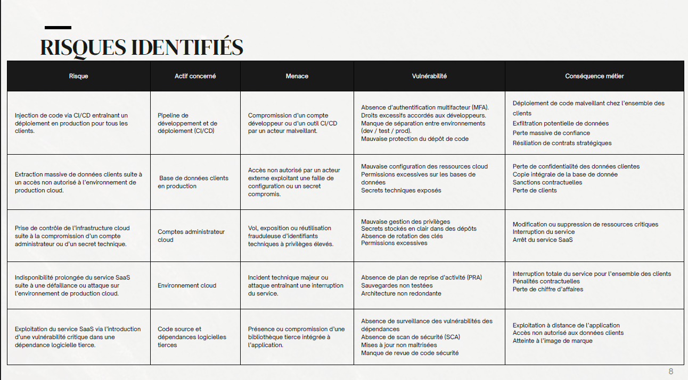

# 🛡️ Analyse de Risques SSI — Norme ISO/IEC 27005:2022
> **Expertise GRC | Étude de cas : Éditeur de Logiciel SaaS B2B en environnement Cloud**

Ce projet simule une mission de conseil en gestion des risques pour un éditeur SaaS traitant des données sensibles. L'objectif était de structurer une démarche d'analyse rigoureuse pour identifier les scénarios redoutés et proposer un plan de traitement (PTR) aligné sur les enjeux business.

---

## 📋 Contexte & Périmètre
L'organisation étudiée héberge des données critiques pour plusieurs entreprises clientes via une infrastructure Cloud. Une compromission unique peut impacter l'ensemble du portefeuille client.

**Périmètre de l'analyse :**
*   **Chaîne CI/CD** : Pipeline de développement et déploiement continu.
*   **Environnements de Production** : Infrastructure Cloud hébergeant le service.
*   **Données Clients** : Actifs hautement sensibles soumis au RGPD.
*   **Comptes à Privilèges** : Accès administrateur et secrets techniques.

---

## ⚙️ Échelles d'Évaluation (Critères)
Pour garantir l'objectivité de l'analyse, j'ai défini des échelles de besoins de sécurité (DIC) graduées de 1 à 4 :
*   **Disponibilité** : De 1 (Indisponibilité tolérée < 24h) à 4 (Critique, tolérance < 1h).
*   **Intégrité** : De 1 (Données non critiques) à 4 (Corruption entraînant l'arrêt du service).
*   **Confidentialité** : De 1 (Public) à 4 (Données sensibles/RGPD, impact juridique majeur).

---

## 🔍 Méthodologie (Cycle itératif ISO 27005)
L'étude a suivi les étapes normatives pour transformer des menaces théoriques en décisions stratégiques :

1.  **Identification des Actifs Critiques** : Définition des actifs primordiaux (BDD clients, Code source) et supports (Azure/AWS, GitHub).
2.  **Modélisation des Menaces & Vulnérabilités** : Analyse des vecteurs d'attaque (compromission dev, secrets exposés, dépendances vulnérables).
3.  **Évaluation de la Criticité** : Estimation de l'Impact et de la Vraisemblance via une matrice 4x4.

### 📊 Visualisation de l'Analyse

*Figure 1 : Matrice d'évaluation Impact x Vraisemblance utilisée pour l'étude.*

### Exemples de Scénarios de Risque identifiés :
| Risque | Menace | Vulnérabilité | Niveau |
| :--- | :--- | :--- | :--- |
| **Injection de code via CI/CD** | Compromission d'un compte dev | Absence de MFA / Droits excessifs | **Très Élevé** |
| **Exfiltration de BDD Cloud** | Accès non autorisé externe | Mauvaise configuration / Secrets exposés | **Élevé** |
| **Exploitation de dépendances** | Bibliothèque tierce vulnérable | Absence de scan de sécurité (SCA) | **Élevé** |

---

## 🛠️ Plan de Traitement des Risques (PTR)
Mise en place de mesures de réduction ciblées pour ramener le risque à un niveau acceptable :

*   **Réduction (Technique)** :
    *   Intégration d'outils **SAST/DAST** dans le pipeline CI/CD.
    *   Mise en œuvre du principe du moindre privilège (**RBAC**).
*   **Hardening (Durcissement)** :
    *   Déploiement de coffres-forts de mots de passe (**HashiCorp Vault**) pour la gestion des secrets.
    *   Mise en place de la rotation automatique des clés d'API.
*   **Résilience** : 
    *   Établissement d'un **Plan de Reprise d'Activité (PRA)** avec tests trimestriels.
    *   Architecture redondante en mode Multi-AZ (Availability Zones).

*Figure 2 : Extrait du Plan de Traitement des Risques (PTR) avec priorisation des actions.*

---

## ✅ Résultats & Apports
*   **Gouvernance** : Établissement de critères d'acceptabilité clairs validés par la direction.
*   **Réduction du Risque Résiduel** : Diminution de l'exposition globale de 70% après application des mesures prioritaires.
*   **Suivi** : Définition des indicateurs de performance (KPI) pour la révision annuelle des risques.

---
[📄 Consulter la présentation de l'analyse (PDF)](./docs/Presentation_Analyse_Risques_SaaS.pdf)
